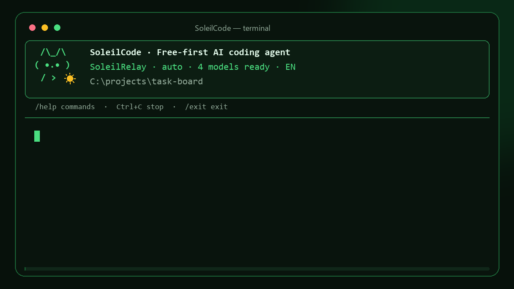
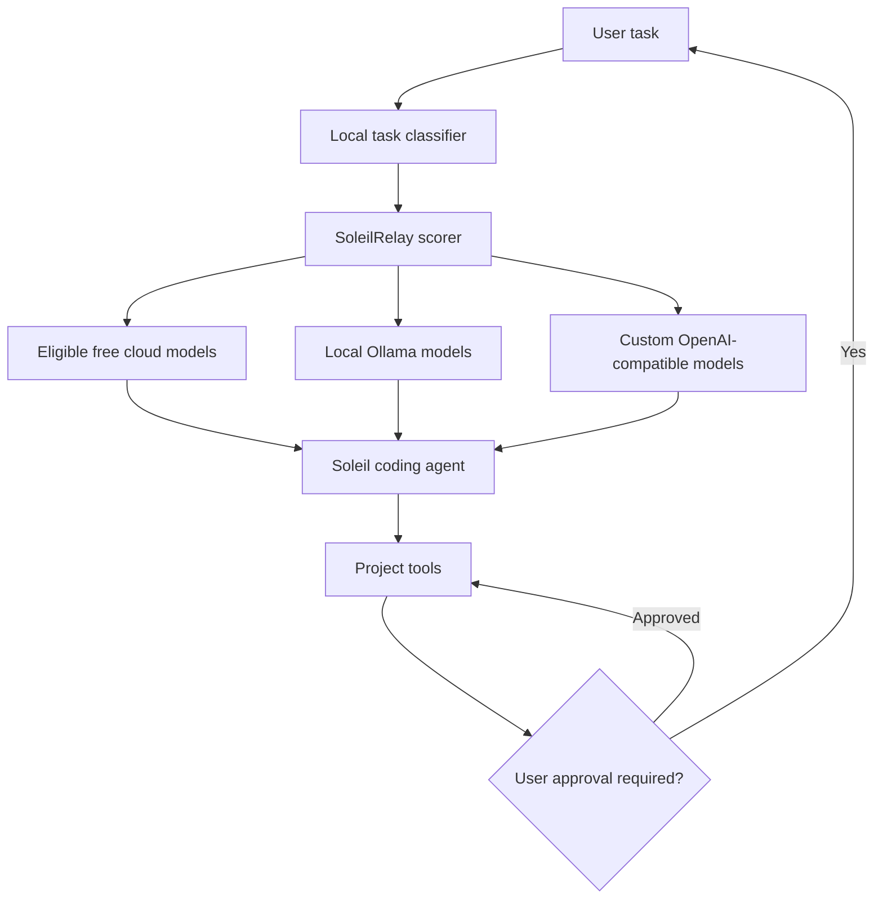

<div align="center">

# ☀ SoleilCode

### A free-first, local-first AI coding agent for your terminal

SoleilCode understands your project, uses tools with explicit approval, and lets
**SoleilRelay** choose the best available free or local model for each task.

[](https://github.com/Xsoleils/SoleilCode/actions/workflows/ci.yml)
[](https://www.npmjs.com/package/soleilcode)
[](https://nodejs.org/)
[](LICENSE)
[](#free-models)
[](docs/BENCHMARKS.md)

</div>



<p align="center">
  <sub>One prompt, automatic free/local model routing, real file tools, and browser verification.</sub>
</p>

## Why SoleilCode?

Most coding agents are tied to one model or a paid subscription. SoleilCode takes
a different approach:

- **Free-first routing** — paid model definitions are rejected.
- **Local-first privacy** — Ollama works without an API token or internet access.
- **Task-aware model selection** — coding, debugging, review, tests, exploration,
  and long-context work can use different models.
- **Graceful fallback** — rate-limited or unavailable providers are cooled down
  while SoleilRelay tries another eligible route.
- **Human-controlled tools** — file writes and commands require approval by default.
- **Ten interface languages** — change language without reinstalling or editing code.
- **Project-agent behavior** — coding requests inspect the workspace, write real files,
  verify the result, and report exact paths instead of pasting an unfinished code block.
- **Native tool calling** — Groq, OpenRouter, Gemini, compatible endpoints, and
  supported Ollama models can call project tools through provider-native functions.
- **Recoverable edits** — file writes create local checkpoints that can be restored
  with `/undo`.
- **Runtime browser checks** — web projects can be opened in an installed Edge,
  Chrome, or Chromium browser with console errors, interactions, and screenshots.
- **Automation and evaluation** — `soleil run --json` supports scripts and CI, while
  `soleil bench` measures real coding-agent behavior in isolated projects.

> SoleilCode is an early-stage project. Review proposed edits and terminal commands
> before approving them, especially in important repositories.

## Highlights

| Area | What is included |
| --- | --- |
| Terminal experience | Full-screen green interface, persistent cat header, live model and tool activity |
| Project tools | List/read/search files, write/replace, commands, Git diff, real browser verification |
| Model routing | Groq, Gemini, OpenRouter, Ollama, and custom OpenAI-compatible endpoints |
| Cost controls | Only `free` and `local` model definitions are eligible |
| Privacy modes | `auto`, `free`, `local`, and `private` |
| Token center | Hidden token entry, multiple accounts, fingerprints, listing, and removal |
| Safety | Workspace boundary, secret-file blocking, explicit write/command approval |
| Languages | English, Turkish, Spanish, French, German, Italian, Portuguese, Russian, Japanese, Korean |
| Automation | Headless JSON runs, built-in smoke/core benchmark suites, checkpoints and undo |

## Agent workflow

For project tasks, SoleilCode behaves as an execution agent:

1. It takes a bounded snapshot of the current project structure.
2. SoleilRelay classifies the task and selects a suitable free or local model.
3. The provider receives native function definitions and the model calls one project
   tool at a time. Text JSON remains as a compatibility fallback for older models.
4. The model inspects, writes, replaces, or verifies files through bounded tools.
5. Every approved `write_file` or `replace_in_file` captures the previous file state.
6. Browser applications are checked in a real locally installed Chromium browser.
7. Malformed, flattened, or truncated fallback JSON is repaired instead of printed as chat.
8. Edit tasks cannot finish until a file write succeeds or the user denies it.
9. The final answer includes the exact files that were created or changed.

When a standalone app is requested from a general workspace, the agent is instructed
to create a descriptive subdirectory such as `snake-game/index.html`. When the
current directory is already dedicated to the app, it writes directly there.

## Quick start

### Requirements

- Node.js 22 or newer
- npm and a Windows, macOS, or Linux terminal
- At least one local model or free provider token

### Install from npm

```bash
npm install -g soleilcode
soleil
```

### Install from source

Clone the repository, open the folder, and run:

```bash
npm install
npm run build
npm link
```

Windows users can alternatively run `install-windows.cmd`.

Then open any project directory and start SoleilCode:

```bash
soleil
```

Check discovered models:

```bash
soleil doctor
```

Open the guided free-model and token center:

```bash
soleil setup
```

Work in a specific directory:

```bash
soleil --cwd ./my-app
```

Run one task without the interactive interface:

```bash
soleil run "fix the failing login test" --cwd ./my-app --yes --json
```

Run the fast one-task benchmark or the three-task core suite:

```bash
soleil bench --suite smoke
soleil bench --suite core --runs 3 --json
```

Benchmarks use the configured free/local routes and therefore consume their quota.
Each case runs in a new temporary project that is removed after verification.
See the [benchmark methodology and latest verified snapshot](docs/BENCHMARKS.md).

## Headless automation

`soleil run` uses the same routing, tools, safety boundaries, checkpoints, and agent
loop as the interactive interface. JSON output includes the final answer, model
attempts, token usage when reported by the provider, tool results, protocol repair
count, timing, and the generated checkpoint.

```bash
soleil run "update the README" --yes --json
soleil run --prompt-file task.txt --cwd ./my-app --yes --json
```

Without `--yes`, headless writes and commands are denied because no interactive
approval prompt is available. Use automatic approval only in controlled workspaces.

## Browser verification

The `browser_test` tool starts an ephemeral local server, launches an installed
Microsoft Edge, Google Chrome, or Chromium executable, performs requested keyboard
interactions, records page and console errors, and saves a screenshot under
`.soleil/artifacts/`.

External network requests and service workers are blocked during verification.
Secret paths such as `.env`, `.git`, `.soleil`, and private-key files are never
served. Set `SOLEIL_BROWSER_PATH` when the browser executable is installed in a
non-standard location.

## Checkpoints and undo

Before SoleilCode overwrites or replaces a file, it stores that file's previous
state under `.soleil/checkpoints/`. In the interactive interface:

```text
/checkpoints
/undo
```

Undo restores edited files and removes files that the agent created in the latest
checkpoint. Commands can modify files outside SoleilCode's file tools, so command
side effects are intentionally not claimed as reversible.

## Interface languages

SoleilCode ships with ten selectable interface languages:

| Code | Language | Code | Language |
| --- | --- | --- | --- |
| `en` | English | `it` | Italiano |
| `tr` | Türkçe | `pt` | Português |
| `es` | Español | `ru` | Русский |
| `fr` | Français | `ja` | 日本語 |
| `de` | Deutsch | `ko` | 한국어 |

Use the visual picker:

```bash
soleil language
```

Or choose a language for one launch:

```bash
soleil --language es
```

Inside the interactive agent:

```text
/language
/language ja
```

Selections made with the picker or `/language CODE` are stored in
`%USERPROFILE%\.soleilcode\config.json`.

## Free models

The built-in setup center explains how to connect these routes:

| Provider | Route | Best fit |
| --- | --- | --- |
| Ollama | Models installed on your machine | Fully local and private work |
| Groq | Free-plan coding and general models | Fast edits, tests, and debugging |
| Google Gemini | Free-tier Flash models | Exploration and long-context tasks |
| OpenRouter | `openrouter/free` | Automatic selection among available free models |
| Custom endpoint | OpenAI-compatible server | Self-hosted or community endpoints |

Free quotas and model availability are controlled by each provider and can change.
SoleilCode never intentionally upgrades to a paid route, but it cannot determine
whether billing is enabled on an external provider account. For strict zero-cost
use, disable billing at the provider or use Ollama.

### Ollama — fully local

SoleilCode discovers installed models automatically while Ollama is running.
To force a specific model:

```bat
set OLLAMA_MODEL=qwen2.5-coder:7b
soleil --mode local
```

### Groq

```bat
set GROQ_API_KEY=your_token
soleil
```

Optionally set `GROQ_MODEL` to force one model.

### Google Gemini

```bat
set GEMINI_API_KEY=your_token
set GEMINI_MODEL=your_free_model
soleil
```

### OpenRouter

```bat
set OPENROUTER_API_KEY=your_token
soleil
```

The default route is `openrouter/free`. Set `OPENROUTER_MODEL` to use a specific
eligible free model.

### Custom OpenAI-compatible endpoint

```bat
set SOLEIL_BASE_URL=http://127.0.0.1:1234/v1
set SOLEIL_MODEL=local-coder
set SOLEIL_API_KEY=
soleil
```

See [.soleilcode.example.json](.soleilcode.example.json) for project-level
configuration. Store only the environment variable name in configuration files,
never the secret itself.

## Token center

Use `soleil setup` or `/setup` to:

1. Add tokens with hidden terminal input.
2. Keep multiple legitimate accounts for supported providers.
3. List tokens by provider, label, and irreversible short fingerprint.
4. Remove a token without opening the credentials file.
5. Change the interface language.

Tokens are stored in `%USERPROFILE%\.soleilcode\credentials.json` with
user-profile permissions. Raw token values are never printed in status views or
sent to models as chat content.

The current vault format is not encrypted with the operating-system keychain.
Use device encryption and protect your Windows account. Keychain-backed storage
is planned.

## Commands

| Command | Purpose |
| --- | --- |
| `/help` | Show interactive commands |
| `/models` | Show discovered providers and models |
| `/status` | Show SoleilRelay mode and route health |
| `/setup` | Open the free-model and token center |
| `/tokens` | List token labels and fingerprints |
| `/free` | Show built-in free provider guidance |
| `/language` | Open the ten-language selector |
| `/language CODE` | Change and save the interface language |
| `/mode auto` | Use free cloud and local routes |
| `/mode free` | Use free routes |
| `/mode local` | Use local routes only |
| `/mode private` | Keep source code on the device |
| `/checkpoints` | List recoverable agent file checkpoints |
| `/undo` | Restore the latest checkpoint |
| `/clear` | Clear conversation context |
| `/exit` | Exit SoleilCode |

Use `--yes` only in controlled environments to bypass file and command approvals.

## How SoleilRelay works



For every eligible model, SoleilRelay considers:

- configured priority;
- task-specific strengths;
- local/private mode bonuses;
- observed success rate;
- average latency;
- active cooldown after failures or rate limits.

If a provider fails, the next free or local candidate is tried. Short provider
retry windows can be honored once when doing so is faster than abandoning the route.

## Security model

- Project tools cannot leave the selected workspace.
- `.env`, `.git`, private keys, certificates, and common secret files are blocked.
- File writes and terminal commands require approval by default.
- Browser verification is local-only and blocks secret paths and external requests.
- Checkpoints contain only prior contents of files changed through SoleilCode file tools.
- API keys are not included in model prompts.
- Token entry is hidden and token listings show fingerprints only.
- `private` mode only permits local models.

Found a vulnerability? Please follow [SECURITY.md](SECURITY.md) instead of opening
a public issue.

## Development

```bash
npm install
npm run dev
npm test
npm run check
```

The test suite covers native and fallback tool loops, headless JSON execution,
real-browser interaction, checkpoint restoration, benchmark reporting, safe
workspace boundaries, routing, rate-limit retries, credentials, and internationalization.

## Project status

### Available now

- Full terminal coding-agent loop
- Provider-native tool calling with text-protocol fallback
- Automatic workspace inspection and enforced project execution
- Recovery from malformed or truncated open-model tool responses
- Headless `run --json` automation
- Isolated smoke and core benchmark suites
- Real local browser verification with screenshots
- File checkpoints, `/checkpoints`, and `/undo`
- Free/local task-aware routing
- Multiple provider tokens
- Ten-language interface
- Windows installer
- Automated CI across Windows, macOS, and Linux

### Planned

- OS keychain-backed token encryption
- Streaming model output
- Git-aware patch review screen
- Provider health dashboard
- macOS and Linux installers
- Plugin/tool extension API

## Contributing

Issues and pull requests are welcome. Start with [CONTRIBUTING.md](CONTRIBUTING.md)
and keep changes focused, tested, and free-first.

## License

SoleilCode is available under the [MIT License](LICENSE).
